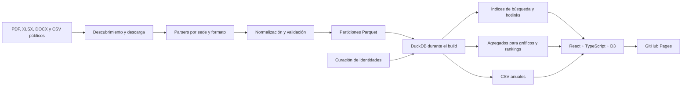

# Explorador de accesos a Olivos y Casa Rosada

Sitio estático y pipeline reproducible para explorar registros públicos de ingreso a Casa Rosada y la Quinta de Olivos. Los datos fueron obtenidos por [Poder Ciudadano](https://poderciudadano.org/) mediante pedidos periódicos de acceso a la información pública.

El proyecto descarga o incorpora documentos oficiales, extrae sus tablas, normaliza personas y movimientos, conserva una base canónica en Parquet y genera archivos compactos para publicar todo en GitHub Pages, sin backend ni base de datos externa.

## Estado de la base

La versión incluida actualmente contiene:

- **2.022.698 registros deduplicados**.
- **87.080 identidades publicadas**, luego de aplicar las unificaciones curadas.
- **1.378 fuentes activas**.
- Registros entre el **8 de enero de 2016** y el **30 de junio de 2026**.
- CSV anuales disponibles para 2016 y para el período 2018–2026.
- Aproximadamente **472 MB** de salida estática completa.

La cobertura no es continua: hay años, meses y archivos sin datos. La propia interfaz incluye un informe que distingue períodos sin una fuente incorporada, archivos vacíos y documentos que no pudieron procesarse. Los PDF escaneados sin una capa de texto utilizable permanecen en cuarentena; OCR todavía no forma parte del proceso automático.

La base combina PDF consolidados y mensuales de Casa Rosada, partes diarios de Olivos, el CSV histórico unificado de 2020–2021 y planillas XLSX/DOCX estructuradas de 2016, 2018, 2019 y 2020. Los PDF originales no se versionan en Git.

## Qué permite hacer el sitio

- Buscar por nombre, DNI o CUIL, tolerando acentos, puntuación, orden de palabras y errores menores.
- Filtrar por sede, año y tipo de registro.
- Seleccionar varias variantes de una misma persona y compararlas con colores consistentes.
- Compartir una selección mediante un hotlink como `#person=id1,id2`.
- Consultar fichas con cronología, sede, destino, motivo, calidad y vínculo a la fuente.
- Descargar en CSV todos los registros de las personas seleccionadas.
- Ordenar la tabla de movimientos por columna y recorrerla en bloques de 100 filas.
- Explorar actividad diaria y mensual, calendario anual, ritmos por día y hora, destinos y motivos.
- Distinguir días compartidos por varias personas y marcar los días con registros de Javier Milei en Casa Rosada.
- Consultar coincidencias temporales entre personas cuando existen horarios y destinos compatibles.
- Ver rankings de visitas diarias por sede, año o presidencia.
- Descargar un CSV comprimido por año.
- Auditar períodos y archivos faltantes desde el informe de cobertura.

Los gráficos consumen agregados precalculados: nunca recorren los dos millones de registros en el navegador. La búsqueda se ejecuta en un Web Worker y utiliza índices fragmentados y comprimidos. Las fichas, hotlinks y co-presencias también se distribuyen en shards pequeños.

## Arquitectura



Componentes principales:

- `pipeline/`: descubrimiento, parsers, importadores históricos, normalización y generación web.
- `data/partitions/`: base canónica particionada en Parquet.
- `data/manifest.json`: inventario y estado de las fuentes.
- `data/curation/`: candidatos y decisiones versionadas sobre identidades.
- `web/`: interfaz en React, TypeScript, Vite y D3.
- `.github/workflows/`: validación, actualización mensual y publicación.

## Desarrollo local

Requisitos:

- Python 3.12 o superior.
- [`uv`](https://docs.astral.sh/uv/).
- Node.js 20 o superior.
- pnpm 10.

Instalación y pruebas:

```bash
uv sync --all-extras
uv run pytest
pnpm --dir web install
pnpm --dir web test
pnpm --dir web build
```

Regenerar índices, analíticas y exportaciones desde las particiones existentes:

```bash
uv run accesos build-web --output web/public/data
```

Levantar la interfaz local:

```bash
pnpm --dir web dev
```

La aplicación queda disponible normalmente en `http://127.0.0.1:5173/`.

## Actualización de datos

La fuente pública esperada puede organizarse así:

```text
casa-rosada/{año}/{mes}/
olivos/{año}/{mes}/
```

El descubrimiento admite `index.json`, listados públicos HTTP de Apache/nginx y FTP anónimo. Para revisar una fuente sin procesarla:

```bash
SOURCE_BASE_URL=https://ejemplo.org/accesos/ uv run accesos discover
```

Para descubrir, descargar y procesar novedades:

```bash
SOURCE_BASE_URL=https://ejemplo.org/accesos/ uv run accesos update
```

Durante el desarrollo también puede utilizarse una carpeta local:

```powershell
uv run accesos update --source "D:\_DATAVIZ\RosadaOlivos\data\Raw"
```

El procesamiento es incremental. El manifiesto compara metadatos y checksum; si una fuente cambió, reemplaza todos los registros procedentes de ese archivo. Una fuente eliminada queda marcada como ausente, pero sus registros históricos no se borran automáticamente.

## Importaciones históricas

Importar TSV previamente normalizados:

```bash
uv run accesos import-legacy "D:\_DATAVIZ\RosadaOlivos\old\normalized_tsv"
```

Descargar recursivamente una carpeta pública de Google Drive para un backfill puntual:

```bash
uv run accesos download-drive ID_DE_CARPETA tmp/historical-pdfs
```

Incorporar PDF históricos legibles y enviar formatos desconocidos a cuarentena:

```bash
uv run accesos backfill-local tmp/historical-pdfs --min-year 2016
```

Reprocesar una sede después de modificar su parser:

```bash
uv run accesos backfill-local tmp/historical-pdfs --min-year 2016 --force-location olivos
```

Importar planillas XLSX y DOCX históricas:

```bash
uv run accesos import-historical-office data/Raw
```

Importar el CSV histórico unificado de Olivos 2020–2021:

```bash
uv run accesos import-olivos-csv old/datos_olivos-csv.csv
```

## Curación de identidades

Los documentos coincidentes pueden consolidarse automáticamente. Las similitudes basadas sólo en nombres generan candidatos de revisión y nunca producen una fusión automática.

Cada regeneración actualiza `data/curation/candidates.csv` con puntaje, nivel de confianza, documentos, períodos, sedes y explicación. El proceso rechaza candidatos con documentos incompatibles y respeta las decisiones guardadas en `data/curation/entity_merges.json`.

Regenerar únicamente los candidatos:

```bash
uv run accesos identity-candidates
```

Abrir la interfaz privada de revisión:

```bash
uv run accesos curate-identities
```

La herramienta escucha sólo en `http://127.0.0.1:8765`. Permite filtrar candidatos por cantidad de visitas, aprobar todas las coincidencias de máxima confianza y guardar unificaciones, rechazos o postergaciones de manera atómica. Ninguna decisión modifica el sitio publicado hasta que `entity_merges.json` sea revisado, versionado y los datos sean regenerados.

## Co-presencias y límites interpretativos

Una co-presencia se calcula sólo cuando dos registros:

- Tienen entrada y salida completas, válidas y de calidad alta.
- Comparten sede, fecha y un destino específico normalizado.
- Sus entradas difieren como máximo 15 minutos y sus salidas, otros 15 minutos.
- Superponen sus intervalos durante al menos 5 minutos.
- Ninguna identidad tiene intervalos incompletos ni 80 o más días de actividad en un año.

Los episodios repetidos se deduplican y sólo se muestran hasta cinco resultados. Es una señal de presencia compatible en los registros: **no demuestra un encuentro ni una interacción entre personas**.

Los datos personales y documentos visibles reproducen información publicada en las fuentes oficiales. La interfaz conserva referencias al archivo y la página de origen para facilitar la auditoría.

## Automatización en GitHub

- `validate.yml` se ejecuta en cada pull request y cada push a `main`: valida Python, frontend, curación, build y límites de tamaño.
- `deploy-pages.yml` publica GitHub Pages sólo después de una validación exitosa originada por un push.
- `update-data.yml` se ejecuta el día 8 de cada mes a las 09:00 UTC y también admite ejecución manual.

La actualización mensual comienza la detección automática en 2023, pero conserva toda la base histórica ya incorporada. Si falla una extracción, no se publica una base parcial: se adjunta un diagnóstico y se abre o actualiza un issue.

Límites comprobados durante CI:

- Aplicación inicial menor de 500 KiB comprimidos.
- Cada shard menor de 3 MB.
- Cada dataset analítico menor de 1 MB.
- Sitio completo menor de 750 MB.

## Variables de configuración

- `SOURCE_BASE_URL`: raíz pública HTTPS, HTTP o FTP.
- `MIN_YEAR`: primer año que recorre la actualización automática; por defecto `2023`.
- `DATA_DIR`: estado y particiones del pipeline; por defecto `data`.
- `WEB_DATA_DIR`: salida estática; por defecto `web/public/data`.
- `LOCAL_SOURCE_ROOT`: carpeta local opcional con archivos fuente.
- `SOURCE_PUBLIC_BASE_URL`: URL pública equivalente a las rutas locales, cuando exista.

## Créditos

- Datos: [Poder Ciudadano](https://poderciudadano.org/).
- Creación y diseño: [Andrés Snitcofsky · Visualizando](https://visualizando.ar/).
